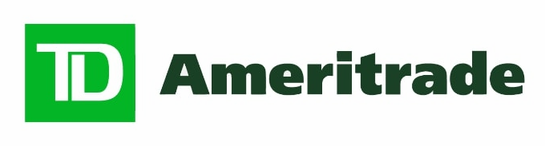
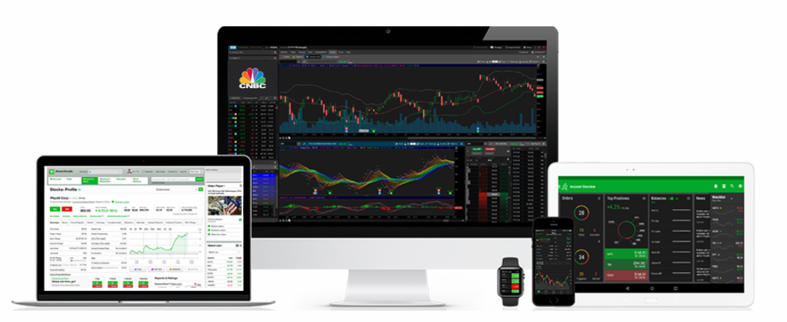
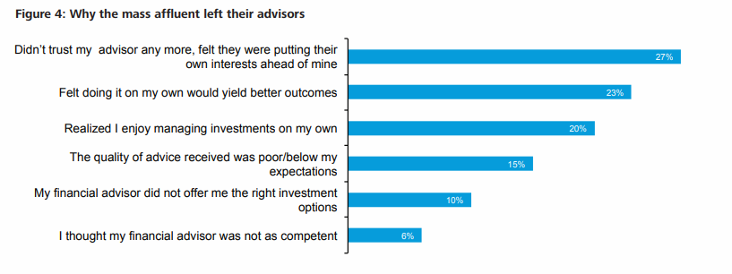

# Joe Ricketts and TD Ameritrade

---

## *Overview and Origin*

TD Ameritrade originated as First Omaha Securities and was founded in Omaha Nebraska by a businessman named Joe Ricketts. Ricketts was a salesman working at Dean Witter Reynolds just before he took an entrepreneural move to open his own brokerage. He acquired First Omaha Securities in 1975 then through various name changes, they formed as Ameritrade Holding Corporation in 1996. Ameritrade Holding Corp. later became TD Ameritrade following the purchase of TD Waterhouse USA in 2006.

First Omaha Securities was founded after the SEC did away with fixed brokerage commissions in May of 1975. Through discounted commissions was the foundation of an effort to simplify access to Wall Street by utilizing technology to benefit the individual investor.
    
Joe raised $50,000 from four investors and an additional $12,500 from friends and family to start First Omaha Securities. Then in 1997 an additional $35.3 million was raised in the Ameritrade Holding Corp. IPO valuing the company at $217.8 million. TD Ameritrade has since been acquired in an all-stock deal by Charles Schwab in Nov of 2019 for $26 billion. 

---

## *Business Activities*

When fixed brokerage commissions were relinquished by the SEC, First Omaha saw an opportunity to offer discounted commissions. This combined with technology has been the driving force behind TD Ameritrade to make Wall Street more accessible to the retail investor.

Ricketts opted to leverage technology to benefit the retail investor. Now as of January 2021 retail investors make up for a 25% average in daily trading volume. TD Ameritrade offers a powerful set of tools for beginning to advanced investors. By targeting individual investors TD has been able to implement an extensive platform complete with educational tools, commission free trading, and an intuitive user interface.

Some of the many technologies TD Ameritrade utilize include JAVA, JavaScript, Python, TypeScript, AngularJS, Dyn, and Apache HTTP Server. TD offers a wide verity of services including multiple management platforms which conform to the individual’s preferred method of execution. This includes its web service plus its umbrella platform, Thinkorswim, which is unique to either computer, tablet, mobile phone, or smart watch. By utilizing these many tools the Thinkorswim platform provides a large variety of functions including option and stock trading, extensive market research tools, and the ability to customize analytic tools with through APIs.

 

---

## *Landscape*

TD Ameritrade falls under both Wealth and Investment Management. They provide access to many investment choices including stocks, bonds, ETFs, mutual funds, futures, forex, options, IRA’s, annuities and much more. There is also a large library for education as well as around the clock customer service.

Younger generations of retail investors, largely acting in skepticism, has driven a rise in digitally backed asset management. Through the use of user-friendly platforms, social media, robo advisors, algorithmic asset allocation, and now commission free trading, retail investing is seeing a shift of wealth into the hands of younger investors. Companies such as Robinhood have played a large roll in “gamifying” investing by offering paperless sign up, one-click trading, and an easily navigable interface. As new and innovative frameworks hit the market it is becoming clearer that a traditional financial advisor ar less and less sought after. Newer generations are looking to connect with peers, self-educate, and invest in ways that allow them to have total control. This socially driven way of investing has minted quite a few platforms in its wake. There is a wealth of information readily available to connect with from websites like Investopedia, social platforms like Stocktwits and brokerages like TD offering multiple forms of education. This fueling a high demand for “accurate, real-time, aggregated views of financial assets” and now tools that were once only available to high asset management funds are now being demanded for use by the individual investors. One can simply log on to a free website such as Finviz and screen for stocks that will fit their parameters. Then on a more advanced scale, platforms like TD’s Thinkorswim allow for the use of APIs to integrate personalization of sector analytics and study instruments.

Older brokerages such as Interactive Brokers, E-trade, and Fidelity have had to fully integrate their platforms to conform to mobile devices with user-friendly interfaces. This only fueling the explosive growth in retail investors. TD Ameritrade’s history of leveraging technology positioned them well to benefit from the growing investing trends this leaving them ranked #1 overall by Stockbrokers.com in 2021.

---

## *Results*

From the early days of financial planning and high commission rates to whole databases of educational tools and self-sufficient investing strategies, TD Ameritrade has rose to top, Joe Ricketts revolutionized investing with discount brokerage services and evolving technologies. In 1988 under the company name TransTerra Co. Ricketts was the first to implement touchtone telephone trading becoming the first to automate trading. Against all odds his clientele was largely discouraged by the idea of pressing a button on there telephone to purchase equity in a company. But this quickly changed as commission costs had dropped from $25/100 shares to $.03 cents a share. Then in 1994 K. Aufhauser & Company were the first to develop internet trading. K. Aufhauser & Company would one year later be acquired by Ricketts under TransTerra CO. TransTerra saw a 300 percent increase in online trading one year in the late 90s positioning itself well for the growing retail interest. After TransTerra came Ameritrade Holding Co then Ameritrade Inc, his company was still struggling to get ahead of big names like Charles Schwab and E-Trade. Ricketts decided to lower his commission rates once again to $8 per order while launching a multimillion-dollar marketing campaign. This triggered enormous growth in Ameritrade Inc, taking the number of accounts from 98,000 to 560,000, between 1997 and 1999. TD Ameritrade ultimately grew to one of the most widely used and revolutionizing brokerages in the financial markets. TD now proudly serves over 11 million clients with an average of 500,000 trades placed every day

In comparison to its competitors TD Ameritrade is leading the way. With many associated metrics such as commissions, account fees, trading tools, educational tools, and investment options. Though TD is behind in margin rates it provides powerful tools for user experience, a comprehensive library of educational tools, extensive investment options and can serve the needs for beginners to advance traders/investors. However, being the #1 rated brokerage by many, TD still falls behind Charles Schwab and Fidelity for investment purposes. Charles Schwab is top rated for IRAs and Fidelity top rated for the everyday investor.

---

## *Recommendations*

After utilizing TD’s services for almost five years now I can say that I am very pleased with their overall experience. If there is any suggestion I can make, it is that they integrate cryptocurrency trading and a crypto wallet as soon as possible. TD is in the process, but I believe this should have been done much sooner. As of now users are only able to trade Bitcoin futures and micro Bitcoin futures. 

TD is currently invested in ErisX for cryptocurrency trading, I would like to see this platform integrated with in TD for an all-in-one experience. By offering crypto trading TD will be able to significantly expand its user base. If a wallet was integrated the means for payment services becomes an option allowing for a more versatile platform. I also believe it is sensible to combine a crypto wallet with the equity markets to utilize many forms of value transfer. As a short and midterm investor, I prefer to have ease of use when I transfer my securities.

---

## *Conclusion*
        
TD Ameritrade grew to one of the most widely used investing platforms from a small time brokerage in the mid 70s. This could not have been done without Joe Ricketts commitment to apply new technologies and cheaper commissions. By growing his brokerage into a simple to use yet advanced system, he was able to ease the investing process. Thus, inspiring millions of individual investors to self educate and take control of their financial goals. 

---

Sources:

[About TD Ameritrade](https://www.tdameritrade.com/about-us.html)

[Why choose TD](https://www.tdameritrade.com/why-td-ameritrade.html)

[TD and Cryptocurrency](https://www.tdameritrade.com/investment-products/cryptocurrency-trading.html)

[About Joe Ricketts](https://www.joericketts.com/about/)

[Crunchbase](https://www.crunchbase.com/organization/td-ameritrade)

[Forbes - The Next Charles Schwab](https://www.forbes.com/global/1999/0705/0213104a.html?sh=782448f56344)

[Ameritrade Holding Corporation History](http://www.fundinguniverse.com/company-histories/ameritrade-holding-corporation-history/)

[PYMNTS - Retail Investors Comprise 10 Pct of US Daily Market Trading](https://www.pymnts.com/markets/2021/retail-investors-comprise-10-pct-of-us-daily-market-trading/)

[Stackshare](https://stackshare.io/td-ameritrade/tdameritrade-com)

[Reuters - Factbox: The U.S. retail trading frenzy in numbers](https://www.reuters.com/article/us-retail-trading-numbers/factbox-the-u-s-retail-trading-frenzy-in-numbers-idUSKBN29Y2PW)

[Deloitte - 10 Disruptive Trends in Wealth Management](https://www2.deloitte.com/content/dam/Deloitte/us/Documents/strategy/us-cons-disruptors-in-wealth-mgmt-final.pdf)

[Deloitte - Digital Disruption in Wealth Management](https://www2.deloitte.com/content/dam/Deloitte/us/Documents/strategy/us-cons-digital-disruption_061114.pdf)

[Stockbrokers - 5 Best Trading Platforms 2021](https://www.stockbrokers.com/guides/online-stock-brokers)

[Stockbrokers - TD Ameritrade Review](https://www.stockbrokers.com/review/tdameritrade)

[Stockbrokers - Online Brokerage Comparison Tool](https://www.stockbrokers.com/compare)

